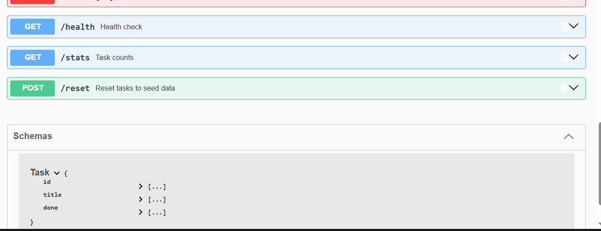

# Task API

A small CRUD API for managing an in-memory to-do list. Built with Node.js and Express.

## What this is

Five endpoints that let you create, read, update, and delete tasks. Data lives only in
memory (a JS array) — it resets every time the server restarts. 

## How to run it

```bash
npm install
node server.js
```

The server starts on **http://localhost:3000**.
Interactive docs (Swagger UI) are at **http://localhost:3000/docs**.

## Endpoints

| Method | Path         | Description                        | Success | Errors        |
|--------|--------------|-------------------------------------|---------|---------------|
| GET    | `/`          | API info                            | 200     | —             |
| GET    | `/health`    | Health check                        | 200     | —             |
| GET    | `/tasks`     | List all tasks                      | 200     | —             |
| GET    | `/tasks/:id` | Get one task                        | 200     | 404           |
| POST   | `/tasks`     | Create a task (`{ "title": "..." }`)| 201     | 400           |
| PUT    | `/tasks/:id` | Update a task's title and/or done   | 200     | 400, 404      |
| DELETE | `/tasks/:id` | Delete a task                       | 204     | 404           |
| GET    | `/stats`     | Task counts (total/done/open)       | 200     | —             |
| POST   | `/reset`     | Reset to the 3 seed tasks           | 200     | —             |

## Example: creating a task

```bash
curl -i -X POST http://localhost:3000/tasks \
  -H "Content-Type: application/json" \
  -d '{"title":"Buy milk"}'
```

```
HTTP/1.1 201 Created
Content-Type: application/json; charset=utf-8

{"id":4,"title":"Buy milk","done":false}
```

## Swagger UI


